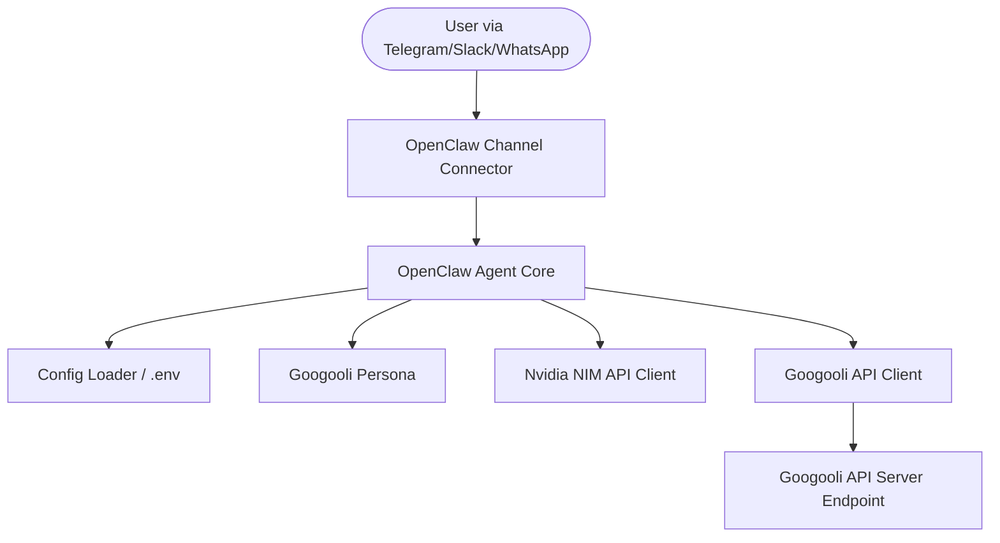

# OpenClaw Agent Architecture & Interfaces

## 1. System Architecture Diagram



## 2. Config & Environment Variables (.env)
Required configurations:
* `NVIDIA_API_KEY`: API key for Nvidia NIM services.
* `NVIDIA_MODEL_NAME`: Target NIM model (e.g., `meta/llama-3.1-70b-instruct`).
* `GOOGOOLI_API_URL`: Base URL of the primary Googooli API.
* `GOOGOOLI_API_KEY`: Authentication key for Googooli API.
* `TELEGRAM_BOT_TOKEN`: Token for Telegram channel.
* `SLACK_BOT_TOKEN`: Token for Slack channel.

## 3. Data Models & Typings (Python)

```python
from typing import Dict, Any, List, Optional
from pydantic import BaseModel

class UserMessage(BaseModel):
    user_id: str
    channel: str  # 'telegram', 'slack', etc.
    text: str
    metadata: Optional[Dict[str, Any]] = None

class AgentResponse(BaseModel):
    text: str
    metadata: Optional[Dict[str, Any]] = None
```

## 4. API Error Handling & Fallbacks
* **NIM Timeout/Outage**: Fallback to a secondary model or return a graceful error message indicating API unavailability.
* **Googooli Endpoint Offline**: Log warning, run with base persona only without dynamic context injection, alerting user of degraded mode.
